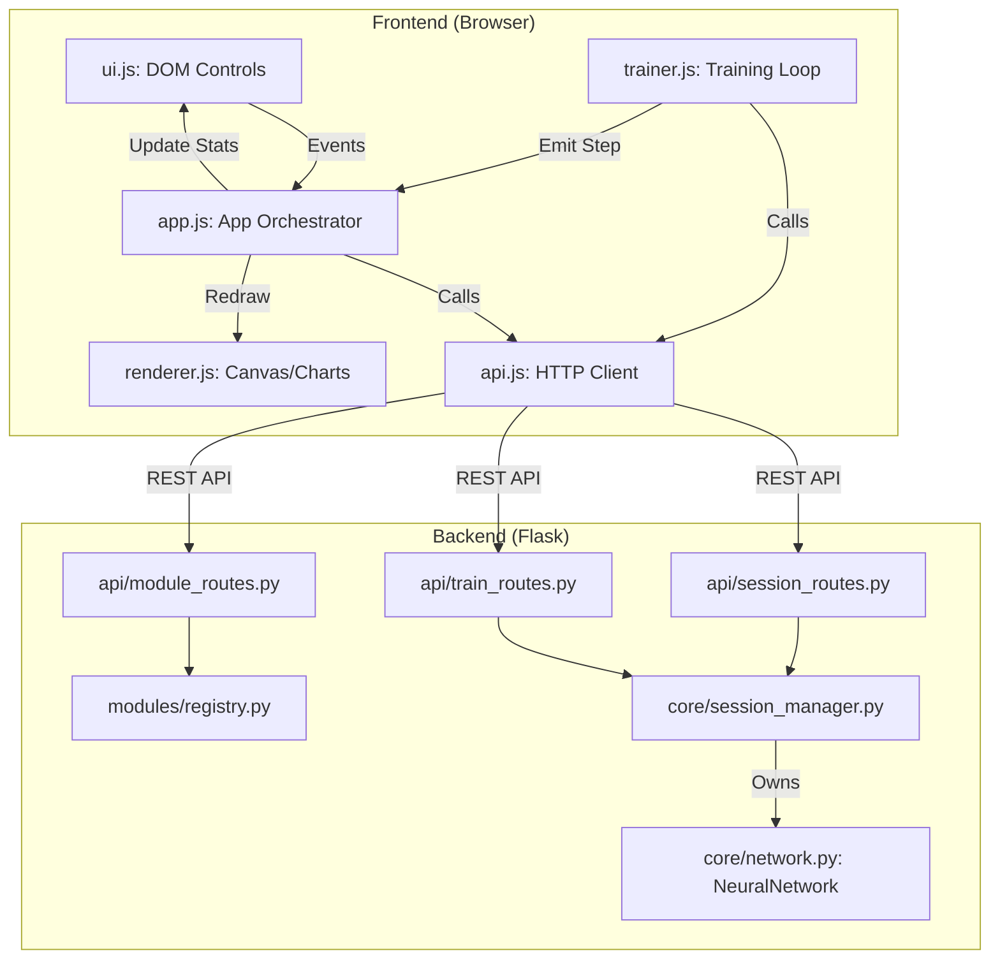

# NNStudio Documentation

## Overview
NNStudio is a modular, web-based neural network playground designed for educational and experimental purposes. It allows users to build, train, and visualize multi-layer perceptrons (MLPs) and other architectures in real-time. The system is split into a Python/Flask backend for the neural network engine and a JavaScript/Canvas frontend for the interactive UI.

---

## File Structure

### Backend (`app/`)
- **`run.py`**: The application entry point. Initializes the Flask app.
- **`app/__init__.py`**: Flask application factory. Sets up blueprints and the `ModuleRegistry`.
- **`app/api/`**: Contains the RESTful API endpoints.
  - `page_routes.py`: Serves the main HTML page.
  - `module_routes.py`: Exposes registered modules (functions, architectures, etc.).
  - `session_routes.py`: Manages the state of the neural network for each user session.
  - `train_routes.py`: Handles training execution and evaluation.
- **`app/core/`**: The heart of the neural network logic.
  - `network.py`: Implements `Layer`, `DenseLayer`, `NeuralNetwork`, and `NetworkBuilder`.
  - `session_manager.py`: Manages in-memory training sessions tied to Flask session IDs.
  - `activations.py`, `losses.py`, `optimizers.py`: Mathematical implementations for network components.
- **`app/modules/`**: Modular components that can be dynamically discovered.
  - `registry.py`: Scans and indexes all modules in the sub-folders.
  - `functions/`: Pre-defined problem sets (e.g., XOR, Logic Gates).
  - `architectures/`: Visual/Structural network definitions.
  - `presets/`: Pre-configured settings for quick experimentation.

### Frontend (`app/static/`, `app/templates/`)
- **`app/templates/pages/index.html`**: The main user interface.
- **`app/static/js/`**:
  - `api.js`: Handles all communication with the backend.
  - `app.js`: The central orchestrator for the frontend state and event handling.
  - `ui.js`: Manages the DOM elements and control panels.
  - `trainer.js`: Handles the asynchronous training loop.
  - `renderer.js`: Custom canvas renderers for the network graph and loss charts.

---

## Core Components

### 1. `NeuralNetwork` (`app/core/network.py`)
The engine responsible for forward passes, backpropagation, and weight updates. It is entirely object-oriented, allowing for flexible layer configurations.

### 2. `SessionManager` (`app/core/session_manager.py`)
Since neural networks are stateful, the backend must remember each user's network. `SessionManager` stores `TrainingSession` objects in-memory, keyed by the browser's session cookie. This allows multiple users to work on different models simultaneously.

### 3. `ModuleRegistry` (`app/modules/registry.py`)
A dynamic discovery system. Any Python class inheriting from `BaseModule` in the `app/modules/` directory is automatically detected and registered. This makes it easy to add new problem sets or architectures without changing core code.

---

## Data Flow & Interaction Graph

---

## Key Variables & State

### Frontend (`app.js`)
- `this._registry`: Contains all available functions, architectures, and presets (injected via Jinja).
- `this._snapshot`: The latest state of the network received from the server (weights, biases, activations, loss history).
- `this._fnMeta`: Metadata for the current target function (inputs, outputs, labels).

### Backend (`TrainingSession`)
- `session_id`: Unique identifier for the browser session.
- `network`: An instance of `NeuralNetwork`.
- `dataset`: The current list of training samples (input-output pairs).
- `func_key`: Key for the currently selected problem (e.g., "xor").

---

## API Documentation

### Session Management (`/api/session`)
- **POST `/build`**: Constructs a new network.
  - *Payload*: `{ func_key, hidden_layers, neurons, activation, optimizer, lr, loss, dropout, weight_decay }`
- **GET `/snapshot`**: Retrieves the full state of the current network for visualization.
- **POST `/reset`**: Re-randomizes weights without changing the architecture.

### Training (`/api/train`)
- **POST `/step`**: Executes a specified number of training epochs.
  - *Payload*: `{ steps, lr }`
- **POST `/evaluate`**: Runs a forward pass on all training samples and returns the results.

### Modules (`/api/modules`)
- **GET `/all`**: Returns the entire `ModuleRegistry` contents.
- **GET `/functions/<key>/dataset`**: Returns the dataset for a specific problem.
