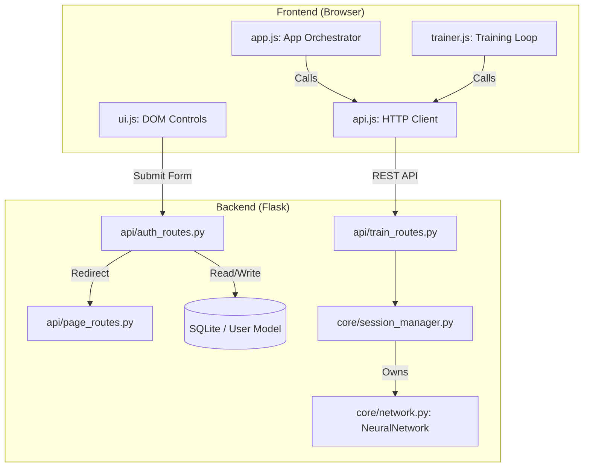

# NNStudio Documentation

## Overview
NNStudio is a modular, web-based neural network playground designed for educational and experimental purposes. It allows users to build, train, and visualize multi-layer perceptrons (MLPs) and other architectures in real-time. The system is split into a Python/Flask backend for the neural network engine and a JavaScript/Canvas frontend for the interactive UI.

---

## File Structure

### Backend (`app/`)
- **`run.py`**: The application entry point. Initializes the Flask app.
- **`manage_users.py`**: CLI tool to create, update, and delete users from the terminal.
- **`app/__init__.py`**: Flask application factory. Sets up SQLAlchemy, Flask-Login, and the `ModuleRegistry`.
- **`app/models/`**: Contains the database models.
  - `__init__.py`: Exposes models for easier imports.
  - `user.py`: Defines the `User` model.
  - `preset.py`: Defines the `Preset` model (user-specific configurations).
- **`app/api/`**: Contains the RESTful API endpoints.
  - `page_routes.py`: Serves the main SPA shell (protected by login).
  - `auth_routes.py`: Handles login, signup (including preset seeding), and logout logic.
  - `preset_routes.py`: CRUD operations for user-saved network presets.
  - `module_routes.py`: Exposes registered modules (including user presets from DB).
  - `session_routes.py`: Manages the state of the neural network for each user session.
  - `train_routes.py`: Handles training execution and evaluation.
- **`app/core/`**: The heart of the neural network logic.
  - `network.py`: Implements `Layer`, `DenseLayer`, `NeuralNetwork`, and `NetworkBuilder`.
  - `session_manager.py`: Manages in-memory training sessions tied to Flask session IDs.
  - `activations.py`, `losses.py`, `optimizers.py`: Mathematical implementations for network components.

### Frontend (`app/static/`, `app/templates/`)
- **`app/static/css/`**:
  - `main.css`: Core application styles.
  - `auth.css`: Styles for login and signup pages.
- **`app/templates/pages/`**:
  - `index.html`: The main dashboard (requires authentication).
  - `login.html`: User login page.
  - `signup.html`: User registration page.
- **`app/static/js/`**:
  - `api.js`: Handles all communication with the backend.
  - `app.js`: The central orchestrator for the frontend state and event handling.
  - `ui.js`: Manages the DOM elements and control panels.
  - `trainer.js`: Handles the asynchronous training loop.
  - `renderer.js`: Custom canvas renderers for the network graph and loss charts.

---

## Core Components

### 1. Authentication System
NNStudio uses **Flask-Login** for session management and **Flask-SQLAlchemy** with a SQLite backend for user storage. 
- Passwords are encrypted using `werkzeug.security` (PBKDF2 with SHA256).
- The main tool (`/`) is protected by the `@login_required` decorator.

### 2. `NeuralNetwork` (`app/core/network.py`)
The engine responsible for forward passes, backpropagation, and weight updates. It is entirely object-oriented, allowing for flexible layer configurations.

### 3. `SessionManager` (`app/core/session_manager.py`)
Since neural networks are stateful, the backend must remember each user's network. `SessionManager` stores `TrainingSession` objects in-memory, keyed by the browser's session cookie.

---

## Data Flow & Interaction Graph

---

## API Documentation

### Authentication (`/`)
- **GET `/login`**: Serves the login page.
- **POST `/login`**: Authenticates a user.
- **GET `/signup`**: Serves the signup page.
- **POST `/signup`**: Registers a new user.
- **GET `/logout`**: Destroys the user session.
- **GET `/check-username`**: Returns username availability status (JSON).

### Session Management (`/api/session`)
- **POST `/build`**: Constructs a new network.
- **GET `/snapshot`**: Retrieves the full state of the current network for visualization.
- **POST `/reset`**: Re-randomizes weights without changing the architecture.

### Training (`/api/train`)
- **POST `/step`**: Executes training epochs.
- **POST `/evaluate`**: Runs a forward pass on all training samples.

### Modules (`/api/modules`)
- **GET `/all`**: Returns the entire `ModuleRegistry` contents (with user-specific presets).
- **GET `/functions/<key>/dataset`**: Returns the dataset for a specific problem.

### Presets (`/api/presets`)
- **POST `/save`**: Saves the current network configuration as a new user-specific preset.
- **DELETE `/<int:id>`**: Deletes a user-specific preset by ID.
